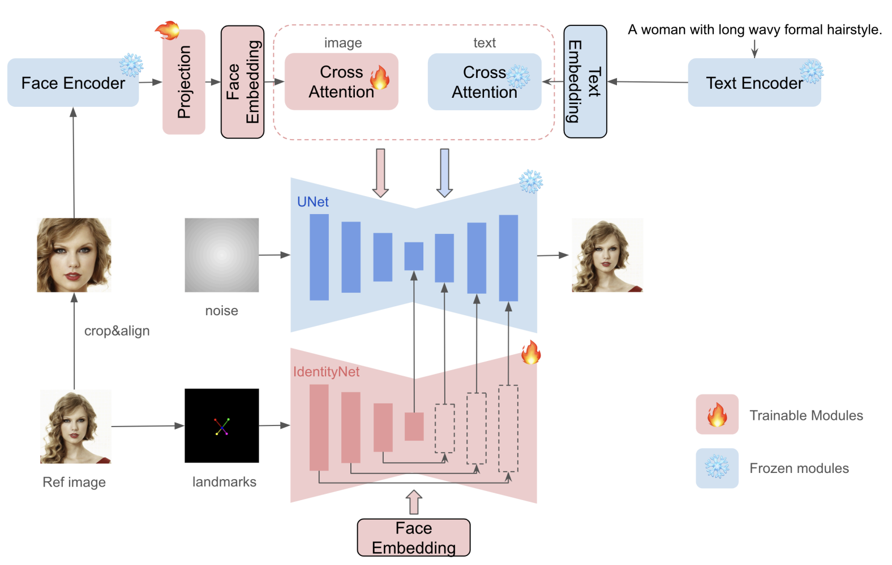

## 目录

- [1.InstantID原理是什么？](#1.InstantID原理是什么？)
- [2.IdentityNet的作用](#2.IdentityNet的作用)
- [原论文链接](https://arxiv.org/pdf/2401.07519)

<h2 id="1.InstantID原理是什么？">1.PuLID原理是什么？</h2>

InstantID 通过轻量级的模块设计，实现了高效、无微调的身份保持图像生成。

1.	**ID 嵌入**：
    - 使用预训练的人脸编码器（如 antelopev21）从参考人脸图像中提取强语义特征（如身份、性别、年龄），这些嵌入作为生成过程的核心条件。
2.	**模块化架构**：
    - **Image Adapter**：一个轻量级模块，通过**解耦的交叉注意力机制**支持图像作为条件输入，与文本条件并行工作。
	- **IdentityNet**：用于捕获复杂的面部特征，结合 5 个关键点（眼睛、鼻子、嘴巴）实现弱空间控制，专注于身份保持而非冗余细节。
3.	**与扩散模型的整合**：
	- 以 Stable Diffusion 为基础，冻结其预训练权重，仅优化新增模块，确保与社区模型的兼容性。
	- 在扩散过程中通过 ID 嵌入和轻量级模块引导生成，避免了微调过程。

<h2 id="2.IdentityNet的作用">2.IdentityNet的作用</h2>

- **高保真度的身份保持**：通过整合面部嵌入（ID Embedding）和空间控制信息，IdentityNet在生成图像时确保面部特征的细节（如五官、表情）能够与参考图像高度一致。
- **弱空间控制**：引入了面部关键点（如眼睛、鼻子和嘴巴的位置信息）作为空间约束条件，避免了过强的限制对编辑灵活性造成影响，同时减少了图像生成中面部自由度过大的问题。