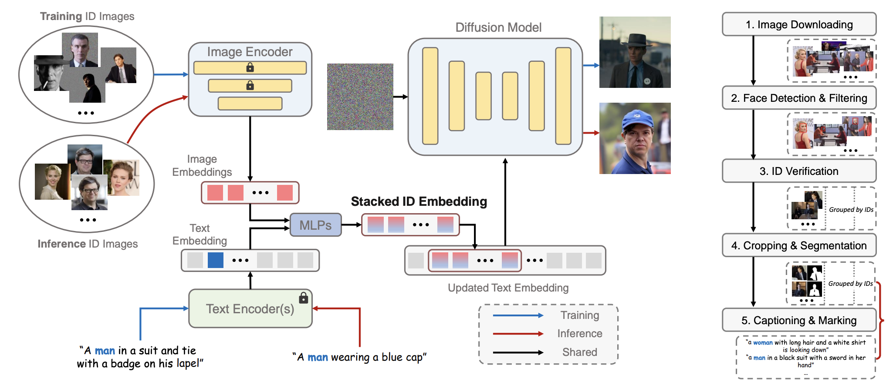

## 目录

- [1.PhotoMaker原理是什么？](#1.PhotoMaker？)
- [2.损失如何计算？](#2.损失如何计算？)
- [原论文链接](https://arxiv.org/pdf/2312.04461)

<h2 id="1.PhotoMaker原理是什么？">1.PhotoMaker原理是什么？</h2>

PhotoMaker 的核心在于使用堆叠 ID 嵌入和文本嵌入共同驱动扩散模型的生成过程，从而达到高保真度和灵活性。

1.	**堆叠 ID 嵌入 (Stacked ID Embedding)**：
    - 将多个输入 ID 图像的特征嵌入进行堆叠，形成统一的 ID 表征。
    - 每个子嵌入对应一个输入图像，保留了丰富的身份特征。
    - 通过模型内的交叉注意力机制，自适应融合 ID 嵌入和文本提示。
2.	**训练数据构建**：
	- PhotoMaker 使用一个由多样化 ID 图像组成的数据集训练。
	- 数据集中每个 ID 包含多视角、多表情、多场景的图像，增强模型泛化能力。
3.	**生成过程**：
	- 将堆叠 ID 嵌入注入到扩散模型的交叉注意力层。
	- 替换文本嵌入中的类别词（如 “man” 或 “woman”）为堆叠 ID 嵌入，确保生成图像与目标 ID 一致。

<h2 id="2.损失如何计算？">2.损失如何计算？</h2>

1.	**ID 保真损失**：
	- 使用基于人脸识别模型（如 ArcFace）的 ID 相似性度量，确保生成的图像与输入 ID 的嵌入一致。
2.	**文本一致性损失**：
	- 采用 CLIP-T 指标度量生成图像与文本提示的相似性，提升文本可控性。
3.	**多样性损失**：
	- 使用面部多样性指标（如 LPIPS）鼓励生成图像在表情、视角等方面具有多样性。
4.	**掩码扩散损失**：
	- 随机遮挡 ID 无关区域，通过扩散模型生成更高质量的 ID 相关区域。