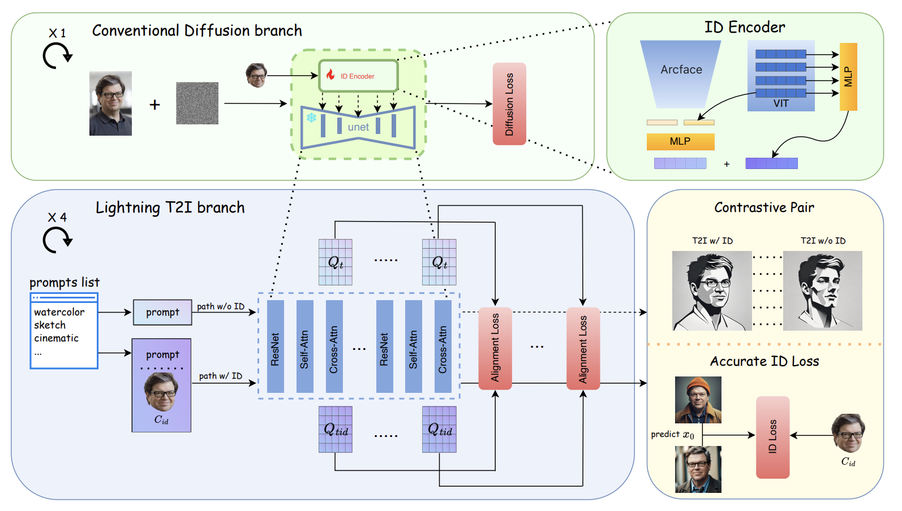

## 目录

- [1.PuLID原理是什么？](#1.PuLID原理是什么？)
- [2.介绍下Lightning T2I 分支](#2.介绍下Lightning-T2I分支)
- [3.零卷积起什么作用？](#3.零卷积起什么作用？)
- [4.什么是对比对齐损失和精确ID损失？](#4.什么是对比对齐损失和精确ID损失？)
- [原论文链接](https://arxiv.org/pdf/2302.05543)

<h2 id="1.PuLID原理是什么？">1.PuLID原理是什么？</h2>

 
1. **核心目标**：
   - PuLID 是一种无需调优的 ID 定制方法，旨在在插入 ID 的同时保持模型原始行为的一致性。
2. **关键技术**：
    - 引入 Lightning T2I 分支，通过快速去噪生成高质量图像。
    - 使用对比对齐损失和精确 ID 损失，在保证 ID 保真度的同时减少干扰。
3. **优势**：
    - 无需大量微调或复杂数据集。
    - 能够处理复杂提示并保持生成的灵活性。

<h2 id="2.介绍下Lightning-T2I分支">2.介绍下Lightning-T2I分支</h2>

- Lightning T2I 分支 是 PuLID 方法中的一个核心部分，目的是通过快速去噪技术，从纯噪声生成高质量图像，同时保持原始模型的行为一致性。与传统的扩散模型需要数百步去噪不同，Lightning T2I 仅需 4 步即可生成图像。
- 其工作原理是，构建两条对比路径：一条仅使用文本提示，另一条同时使用 ID 和文本提示，通过对比学习对齐这两条路径的特征，确保 ID 的插入不会影响图像的背景、光照和风格。
- 这种方法的优势在于：
1.加速生成过程，大大提高了效率；
2.精准插入 ID，不干扰其他图像元素；
3.计算资源低，适合实际应用。

<h2 id="3.零卷积起什么作用？">3.零卷积起什么作用？</h2>

在 ControlNet 中，零卷积通常用于处理**条件输入特征**，以实现以下功能：

1. **条件特征对主干网络的无损注入**：
   - 零卷积可以在初始状态下对输入的条件特征进行透明传递，确保不会干扰主干网络的功能。
   - 随着训练的进行，零卷积可以学习到如何将条件特征整合到生成流程中，使主干网络逐步受到条件的引导。

2. **梯度传递的稳定性**：
   - 零卷积层在初始状态下不对特征施加干扰，有助于稳定梯度传递，避免对原始预训练模型的破坏。

3. **条件融合的灵活性**：
   - 零卷积允许在不同层灵活地调整条件输入特征的影响范围，增强条件控制能力。

<h2 id="4.什么是对比对齐损失和精确ID损失？">4.什么是对比对齐损失和精确ID损失？</h2>

1. **对比对齐损失（Contrastive Alignment Loss）**：
   - 目的是确保在插入 ID 后，模型仍然能保持对文本提示的响应能力，避免 ID 的插入干扰图像的其他部分（如背景、风格等）。
   - 计算方式：构建两条对比路径，一条只使用文本提示，另一条同时使用 ID 和文本提示。在 UNet 的交叉注意力层中，对这两条路径的特征进行对齐，通过计算它们的语义相似度来最小化两者之间的差异。
   - 公式：使用 Softmax 操作对比两条路径的特征，相似度越高，损失越小。
2. **精确 ID 损失（Accurate ID Loss）**：
   - 目的是确保 ID 信息插入后，生成的人脸图像与目标 ID 在视觉上具有高相似度。
   - 计算方式：通过 Lightning T2I 分支 生成一个高质量的图像，然后提取其人脸特征并与目标 ID 的人脸特征进行对比，计算它们的 余弦相似度（Cosine Similarity）。
   - 公式：通过 CosSim 计算生成图像和目标 ID 之间的相似度，值越高，表示 ID 保真度越高