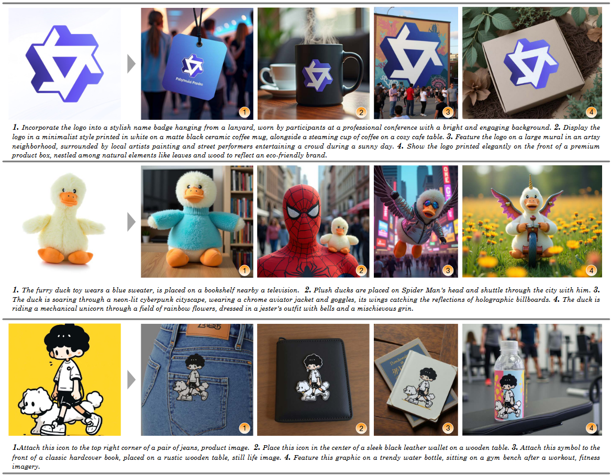
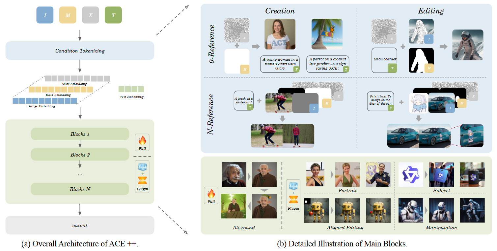

## 目录

- [1.ACE++是什么？](#ACE++是什么？)
- [2.ACE++核心原理是什么？](#2.ACE++核心原理是什么？)
- [3.为什么LUC++在通道维度上进行拼接，而不是在序列维度上拼接？](#3.为什么LUC++在通道维度上进行拼接，而不是在序列维度上拼接？)
- [4.损失如何计算？](#4.损失如何计算？)
- [5.解释下速度（velocity）](#5.解释下速度（velocity）)
- [原论文链接](https://arxiv.org/pdf/2410.00086)

<h2 id="1.ACE++是什么？">1.ACE++是什么？</h2>

ACE++是对ACE模型的改进版本，重点在于基于指令的图像生成和编辑，通过上下文感知的内容填充方法来提升性能。ACE++的核心改进是对**长上下文条件单元LCU**的增强，使其能够支持更多类型的图像生成和编辑任务。

<h2 id="2.ACE++核心原理是什么？">2.ACE++核心原理是什么？</h2>

1. **LCU++输入格式**：
   - ACE++扩展了原先的LCU输入格式，使其支持包括图像生成、编辑、修复等多种任务。其主要创新是LCU++，通过将输入图像、掩码和噪声潜在表示在通道维度上进行拼接，而不是在序列维度上拼接。这种方式有效地减少了模型适应任务时的计算成本，避免了序列拼接对上下文感知框架的干扰，从而提高了训练效率。

2. **两阶段训练过程**：
   - **阶段一**：使用基础的文本到图像生成模型（如FLUX.1-dev）进行“0-ref”任务的预训练。这一步骤帮助模型学习基本的图像生成能力。
   - **阶段二**：使用包括“0-ref”和“N-ref”任务在内的所有任务对模型进行微调，使其能够更好地处理各种生成任务并根据指令生成图像。

3. **模型架构**：
   - **ACE++将LCU++输入格式集成到FLUX.1-dev模型的架构中**，采用完整的注意力框架处理多模态输入（包括图像、掩码和噪声潜在表示）。该模型通过文本嵌入、图像嵌入和掩码嵌入来处理输入数据，然后将这些特征映射为序列令牌，并通过transformer层进行处理。

4. **生成任务与编辑**：
  ACE++能够执行多种图像编辑和生成任务，包括：

  - **肖像一致性生成**：确保生成的图像在不同场景中保持一致的身份。
  - **主体一致性**：在不同场景中保持特定主体的一致性。
  - **局部编辑**：根据掩码对图像的特定区域进行修改，如添加物体或改变细节。
  - **灵活指令**：支持通过灵活的自然语言描述进行动态图像编辑，例如改变背景或添加新元素。
  
5. **高效微调与部署**： 
   ACE++还提供了使用LoRA进行轻量级微调的模型，适用于肖像保护、主题驱动生成和局部编辑等特定领域任务。这使得模型能够快速适应特定任务，减少计算开销。

<h2 id="3.为什么LUC++在通道维度上进行拼接，而不是在序列维度上拼接？">3.为什么LUC++在通道维度上进行拼接，而不是在序列维度上拼接？</h2>

在传统的图像生成任务中，使用文本引导的生成通常是基于文本和图像的序列拼接，也就是把文本的嵌入（text embedding）和图像的嵌入（image embedding）拼接在一起，然后将其输入到生成模型中。这种方法的缺点在于，随着输入条件的增加，模型的计算复杂度会急剧增加，尤其是在面对多模态输入时，拼接的序列会变得非常庞大，导致训练和推理过程中的计算负担较重。

ACE++改进后的方法通过在通道维度拼接输入，而不是在序列维度拼接，避免了上述问题，并在以下方面有效提高了训练效率：
1. **减少计算复杂度**：
   序列拼接会增加序列长度，导致计算量呈平方增长（O(n²)），而通道拼接避免了这种情况，减少了计算负担。

2. **上下文感知优化**：
   序列拼接会使模型处理长序列时出现上下文干扰，而通道拼接使不同输入（如图像、掩码、噪声）独立处理，避免了信息混杂，提高了上下文感知能力。

3. **高效处理多模态输入**：
   通道拼接允许模型并行处理图像、掩码和噪声，而不需要串行计算，有助于提高训练和推理效率。

<h2 id="4.损失如何计算？">4.损失如何计算？</h2>

在ACE++的训练过程中，损失函数的计算基于**预测速度（velocity）**和**目标速度**之间的差异，目标是最小化生成图像与目标图像之间的误差。损失函数包含两个主要部分：

1. **生成损失（Generation Loss）**：
   ACE++模型使用**噪声潜空间（noisy latent space）**进行图像生成。在训练时，模型需要预测当前时刻的**速度（velocity）**，即如何从当前噪声样本（Xt）变化到目标样本（X1）。这个过程使用**线性插值**生成目标样本，并根据模型的预测计算损失。

2. **损失公式**：
   损失函数由两个部分组成：
   - **Lref**：重建损失，用于衡量参考图像（如给定的源图像或参考图像）与生成图像之间的差异。对于没有参考图像的任务（0-ref任务），这个损失为0。
   - **Ltar**：目标损失，用于衡量生成图像与目标图像之间的差异。

   总的损失函数如下：
   
   \[
   L = E_{t, x_0, x_1} \| v_t - u_t \|^2 = \sum_{i=0}^{N-1} E_{t, x_0, x_1} \| v_i - u_i \|^2 + E_{t, x_0, x_1} \| v_N - u_N \|^2
   \]

   - **v_t** 是模型预测的速度，表示从当前噪声样本到目标样本的变化。
   - **u_t** 是实际的目标速度，表示从噪声到目标的真实变化。
   - **Lref** 是参考图像的重建损失（在0-ref任务中为0）。
   - **Ltar** 是目标图像的生成损失。

<h2 id="5.解释下速度（velocity）">5.解释下速度（velocity）</h2>

在ACE++的训练过程中，“速度（velocity）” 是一个用来描述从一个噪声状态到目标状态的变化速率的概念。这个术语其实与扩散模型的训练过程密切相关。

1. **扩散模型和噪声拉丁（Latent）表示**
    扩散模型（Diffusion Models）是一类生成模型，通过模拟数据从纯噪声到目标数据的逐步“扩散”过程来生成样本。具体来说，扩散模型通过反向过程逐步从噪声（随机的潜变量）中恢复出一个清晰的图像。这个过程是通过预测每一步的“变化”来实现的，这里的变化就是指从当前噪声状态到目标状态的变化。

    在ACE++中，模型使用了噪声潜在表示（Xt），它表示当前图像（或数据）在噪声空间中的状态。通过逐步减少噪声，模型希望恢复出清晰的目标图像。

2. **“速度”是什么意思**
    在训练过程中，我们通过计算每个时间步骤的速度，即噪声状态Xt和目标图像X1之间的变化速率，来引导模型的学习过程。可以把速度理解为噪声的变化，即如何从当前的噪声状态（Xt）朝向目标图像的清晰状态（X1）迈进。

    速度的定义是模型预测的从当前噪声状态到目标图像状态的变化量（或者说是梯度）。通过这个预测，模型学习如何一步步去从噪声中生成图像。

3. **为什么需要“速度”**
    在扩散模型中，每一步的生成过程实际上是预测噪声的“去除”过程。为了使模型生成图像，我们不仅需要知道如何从当前噪声生成下一步的清晰图像，还需要知道如何调整每个时间步的噪声去除速率，确保每个步骤的变化能够逐渐使噪声变为清晰的图像。这就是速度的作用：它帮助模型在每个时间步骤中预测如何变化（去除噪声），以接近目标图像。

4. **训练中的速度计算**
    在训练时，模型通过预测当前噪声状态和目标图像之间的速度（变化量），然后与实际的目标速度进行比较。训练的目标是最小化这种预测速度和真实速度之间的差异。

    具体的损失函数中，Lref和Ltar就是计算预测的速度与真实速度之间的差异，并通过反向传播更新模型的参数。