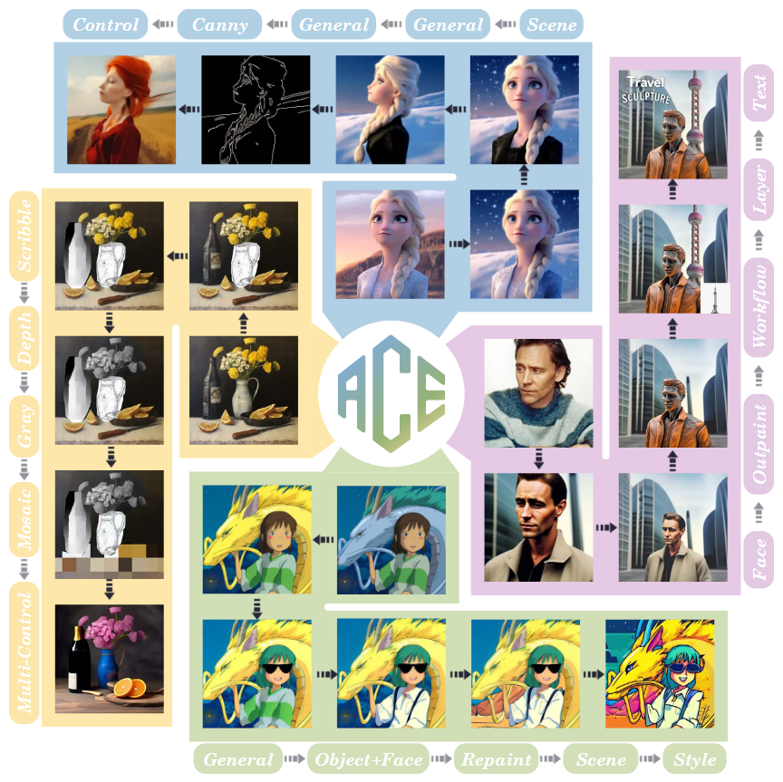
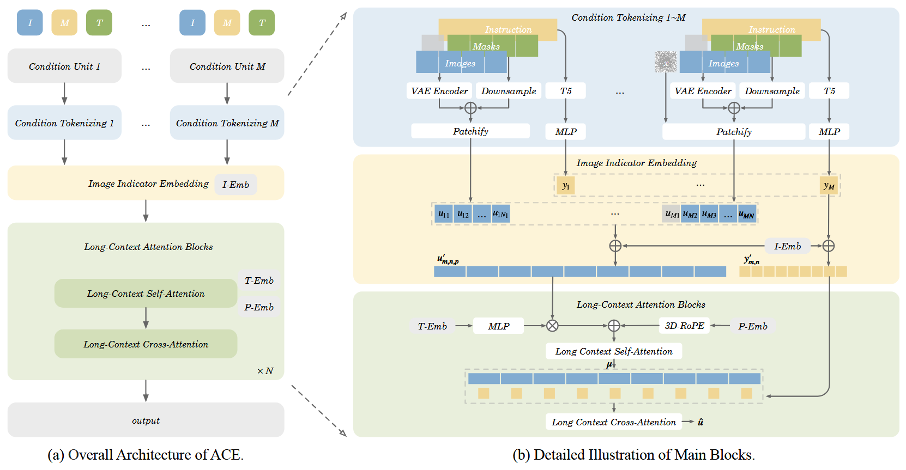

## 目录

- [1.ACE是什么？](#ACE是什么？)
- [2.ACE核心原理是什么？](#2.ACE核心原理是什么？)
- [3.解释下条件单元CU](#3.解释下条件单元CU)
- [4.解释下长上下文条件单元LCU](#4.解释下长上下文条件单元LCU)
- [5.长上下文自注意力机制](#5.长上下文自注意力机制)
- [6.ACE是如何进行训练的？](#6.ACE是如何进行训练的？)
- [原论文链接](https://arxiv.org/pdf/2410.00086)

<h2 id="1.ACE是什么？">1.ACE是什么？</h2>

**ACE: All-round Creator and Editor**是一种视觉生成模型，旨在解决当前视觉生成领域的一个重要问题——不同生成任务需要不同的输入条件，而现有的基础生成模型难以适应多模态条件并完成各种生成任务。ACE模型提出了一种统一的框架，能够处理从文本指导生成到图像编辑等多种任务，且支持多轮交互式生成。

<h2 id="2.ACE核心原理是什么？">2.ACE核心原理是什么？</h2>

ACE（All-round Creator and Editor）的核心原理可以概括为以下几个关键部分：
1. **统一的条件输入格式（CU 和 LCU）**：
   - **条件单元（Condition Unit，CU）**：ACE模型通过定义条件单元（CU），将文本指导、图像和掩码（mask）等多模态输入整合在一起。每个CU包含了文本指令（T）和相应的视觉信息（V），视觉信息包括一组图像（I）和对应的掩码（M）。这种统一格式允许ACE处理各种生成任务，如文本生成、图像编辑和区域编辑等。
   - **长上下文条件单元（Long-context Condition Unit，LCU）**：为了增强模型对复杂任务的理解，ACE引入了LCU，结合了多轮历史生成信息。LCU不仅包含当前的输入，还包括来自先前生成回合的历史数据，这使得模型能够更好地理解上下文，进行多轮交互和长期的任务生成。

2. **基于Transformer的Diffusion模型**：
   - ACE采用了Diffusion Transformer架构，这是一种结合了扩散模型和Transformer模型优势的生成方法。具体来说，ACE通过**Condition Tokenizing**模块将不同类型的输入条件（文本和图像）转化为统一的表示，并通过**Long-context Attention Block**进行处理，确保在多轮生成过程中能够有效集成历史信息，保证生成内容的连贯性。

3. **创新的输入编码方法**：
   - **图像指示嵌入（Image Indicator Embedding）**：为了确保文本指令中的图像顺序与实际图像的顺序一致，ACE引入了图像指示嵌入。这一模块为每个图像分配一个文本指示符，帮助模型理解不同图像在文本中的位置。
   - **长上下文自注意力机制（Long-context Attention）**：在处理多轮生成任务时，ACE的长上下文自注意力机制可以有效地整合所有图像和文本输入的信息，保证每一轮生成都能够参考前面的上下文，从而生成更加连贯和符合指令的图像。

4. **高效的数据收集和处理方法**：
    - 由于高质量的数据对训练生成模型至关重要，ACE提出了两种数据收集方法：合成数据和从大规模图像数据库中配对图像。通过合成数据，可以生成满足特定需求的图像对；而通过从真实数据集中配对图像，则能够提高数据多样性并减少过拟合风险。

<h2 id="3.解释下条件单元CU">3.解释下条件单元CU</h2>

### CU的结构
**条件单元CU**通过统一的输入格式整合了文本指令和视觉信息（包括图像和掩码），使得ACE能够适应多种类型的视觉生成任务。
**CU由两个主要部分组成**：
1. **文本指令（T）**：
   - 文本指令描述了模型生成图像或进行图像编辑时的要求。这些指令可能是简单的描述性文本，也可以是较为复杂的编辑任务指令。
   - 例如，"生成一个穿红色裙子的女孩" 或 "根据给定的边缘图生成完整的花朵图像"。

2. **视觉信息（V）**：
   - 视觉信息部分包含与图像相关的数据，具体包括：
     - **图像（I）**：输入图像，可能是原始图像或者经过处理的图像。
     - **掩码（M）**：掩码用于指定图像的特定区域（例如，图像中的一个部分或目标对象），通常用于图像编辑任务。在没有特定掩码的情况下，掩码可能是一个全1的掩码，表示处理整个图像。
   - 视觉信息可以包含多个图像和相应的掩码。例如，进行对象编辑时，模型可能需要处理多个图像，每个图像可能有一个不同的掩码。

### CU的形式
根据ACE的定义，**条件单元（CU）** 的结构可以表示为：
- **CU = {T, V}**
  - 其中T是文本指令（文本信息），V是视觉信息（包括图像和掩码）。视觉信息V可以进一步拆分为一组图像和掩码对，表示为：
  - **V = {[I1; M1], [I2; M2], ..., [IN; MN]}**
    - 每对 `[Ii; Mi]` 表示第i个输入图像和其对应的掩码（如果有的话）。如果没有掩码，则Mi为一个全1的掩码。
  
<h2 id="4.解释下长上下文条件单元LCU">4.解释下长上下文条件单元LCU</h2>

**长上下文条件单元LCU**的结构是对条件单元（CU）的扩展。在ACE中，CU用于处理每个任务的输入，包括文本指令和视觉信息（如图像和掩码）。而LCU则通过引入历史上下文，将之前的任务信息与当前任务的输入相结合，从而帮助模型更好地理解和生成符合用户意图的内容。

**LCU的结构如下**：

- **LCU = {{Ti−m, Ti−m+1, ..., Ti}, {Vi−m, Vi−m+1, ..., Vi}}**
  
其中：
- **Ti** 是当前回合的文本指令。
- **Vi** 是当前回合的视觉信息（图像和掩码）。
- **Ti−m, Ti−m+1, ..., Ti** 是过去m轮生成任务中的文本指令（历史文本信息）。
- **Vi−m, Vi−m+1, ..., Vi** 是过去m轮生成任务中的视觉信息（历史图像和掩码）。

通过这种方式，LCU不仅包括当前回合的输入数据，还包括历史生成任务的信息。历史信息的引入使得模型能够在当前生成任务中考虑先前的上下文，从而生成更加连贯和符合预期的结果。

<h2 id="5.长上下文自注意力机制">5.长上下文自注意力机制</h2>

长上下文自注意力机制的是基于自注意力机制的扩展。自注意力机制的核心是计算输入序列中每个位置的“注意力分数”，这些分数决定了每个位置与其他位置之间的信息交互。在传统的自注意力机制中，每个输入序列的位置都需要与其他所有位置进行交互，这种计算复杂度为O(n²)，对于长序列来说，计算效率较低。

为了克服这一问题，长上下文自注意力机制通过以下方式进行优化：

1. **时间步嵌入（Time Step Embedding）**：
   - 每个输入位置会被赋予一个时间步嵌入，以帮助模型区分不同的时间步，从而更好地处理长时间序列中的依赖关系。

2. **3D旋转位置编码（3D RoPE）**：
   - 为了更好地处理图像和文本序列中的空间与时间依赖，ACE采用了3D旋转位置编码（3D RoPE），它将位置编码扩展到三维空间，确保不同空间和时间层次的信息能够有效交互。

3. **长上下文自注意力模块（Long-context Self-Attention）**：
   - 在长上下文自注意力模块中，所有输入的图像和文本嵌入都会与历史上下文信息交互。通过这种方式，模型能够在生成每个输出时，同时考虑当前输入和历史信息，从而确保生成的内容更加连贯。

4. **跨注意力机制（Cross-Attention）**：
   - 除了自注意力，长上下文自注意力还包括跨注意力机制。每个输入的图像和文本嵌入只与属于同一条件单元（CU）的其他图像和文本进行交互，而不是与所有条件单元的内容进行交互。这种设计保证了文本和图像的匹配更加精准。

<h2 id="6.ACE是如何进行训练的？">6.ACE是如何进行训练的？</h2>

### 1. 数据收集和构建
训练ACE时，首先需要大量的高质量数据，特别是**图像对**和**文本指令**。由于缺少直接可用的训练数据，ACE提出了两种主要的数据收集方法：

- **合成数据（Synthesis-based Data）**：
  - 使用现有的开源模型生成特定任务的图像对。这些模型通过合成或修改现有图像来生成符合目标条件的图像，例如通过风格转换生成图像，或者通过加入特定对象或背景来修改图像内容。
  - 这种方法的优点是生成速度快，能够快速构建大量的数据对，但也可能面临合成数据过拟合的问题。

- **真实数据对（Pairing from Real Databases）**：
  - 从大规模图像数据库（如LAION-5B、OpenImages等）中提取图像对，确保数据的多样性和真实性。ACE使用了一个**层次化聚合管道**，首先通过图像特征提取（如使用SigLIP提取图像的语义特征），然后通过K-means聚类将图像分为不同的类别。接下来，通过**Union-find算法**进行进一步的分组，确保图像对在语义上相关。
  - 通过这种方法，ACE可以获得高质量的图像对，并减少合成数据可能带来的过拟合问题。

### 2. 指令标签的生成和优化
为了训练ACE，除了图像数据对之外，还需要为每个图像对生成**对应的文本指令**。这些文本指令描述了如何将源图像转换为目标图像。生成指令的过程是一个复杂的任务，因为它不仅仅是描述图像的内容，还需要指出源图像和目标图像之间的差异。

ACE使用了两种方法来生成指令：

- **基于模板的方法（Template-based Method）**：
  - 这种方法利用人工构建的模板，根据任务类型为不同的视觉任务生成指令。这些模板通常包含特定任务所需的通用表达式。模板方法的缺点是生成的指令缺乏多样性，可能导致过拟合。

- **基于多模态大语言模型（MLLM-based Method）**：
  - 为了解决模板方法带来的多样性不足问题，ACE引入了多模态大语言模型（MLLM）来生成更灵活和多样化的指令。通过训练MLLM，ACE能够根据图像的内容和与目标图像的差异生成更丰富和准确的文本指令。

### 3. 训练策略
ACE模型的训练采用了联合训练（Joint Training）策略，即通过一个统一的框架同时训练生成和编辑任务。具体来说，训练过程中的关键步骤包括：

- **多模态输入的处理**：
  - ACE模型需要处理的输入包括文本指令、图像以及对应的掩码。模型需要学习如何将这些多模态信息结合起来，以生成符合指令要求的图像。
  
- **损失函数设计**：
  - 在训练过程中，ACE使用了多种损失函数来优化生成结果。这些损失函数通常包括：
    - **生成损失**：度量生成图像与目标图像之间的差异。
    - **文本一致性损失**：衡量生成图像与文本指令之间的一致性。
    - **图像质量损失**：评估生成图像的美观度、细节和视觉效果。

- **多任务学习**：
  - ACE支持多种任务类型（例如，文本引导生成、语义编辑、重绘等）。在训练过程中，模型需要同时优化多个任务的表现，因此，ACE采用了多任务学习方法，允许模型在不同任务之间共享知识。

- **长上下文训练（Long-context Training）**：
  - 对于需要多轮生成或长时间上下文的任务，ACE会将历史生成信息作为额外的输入，以帮助模型更好地理解任务的全局上下文。通过这种方式，ACE能够在处理复杂任务时保持一致性和连贯性。

