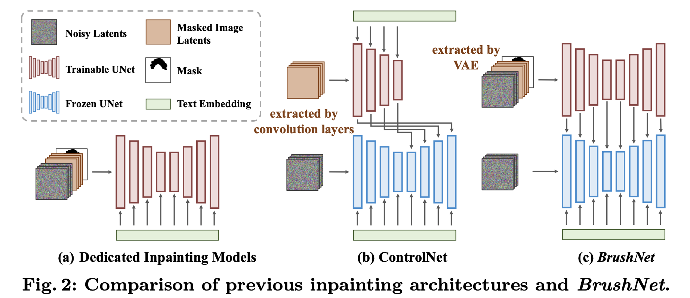

## 目录

- [1.BrushNet原理是什么？](#BrushNet原理是什么？)
- [2.特征层如何融合？](#2.特征层如何融合？)
- [3.模糊混合策略](#3.模糊混合策略)
- [原论文链接](https://arxiv.org/pdf/2403.06976)

<h2 id="1.BrushNet原理是什么？">1.BrushNet原理是什么？</h2>

BrushNet 提出了 双分支扩散架构（Dual-Branch Diffusion Architecture），通过显式分离图像修复特征和生成特征，实现高质量的图像修复。
1. **额外分支（修复分支）**：
专门处理遮挡区域的特征提取。输入包括：
   - 噪声潜变量（Noisy Latent）。
   - 遮挡图像潜变量（Masked Image Latent）。
   - 下采样后的遮罩（Downsampled Mask）。
使用 VAE 编码器 提取遮挡区域特征，确保特征分布与预训练模型一致。
1. **主分支（生成分支）**：
冻结预训练的扩散模型，保持未遮挡区域的生成能力。

<h2 id="2.特征层如何融合？">2.特征层如何融合？</h2>

- 通过 零卷积（Zero Convolution） 将修复分支提取的特征逐层插入到主分支的特征图中。
**实现方式**：与controlnet类似，复制unet
- 实现了像素级别的控制，提升遮挡区域与未遮挡区域的边界一致性。

<h2 id="3.模糊混合策略">3.模糊混合策略</h2>

- 对生成结果与原始图像的未遮挡区域进行模糊混合，进一步优化边界效果，保证视觉一致性。
**实现方式**：使用**高斯模糊**操作平滑遮罩边界，对生成图像和原始图像进行像素级加权混合