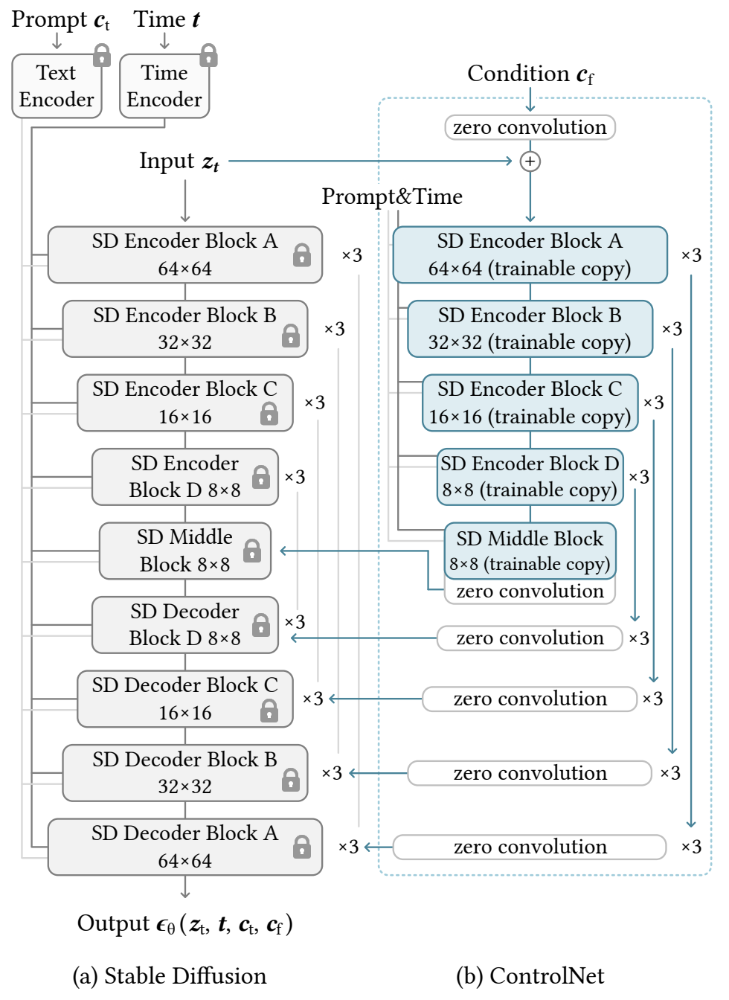
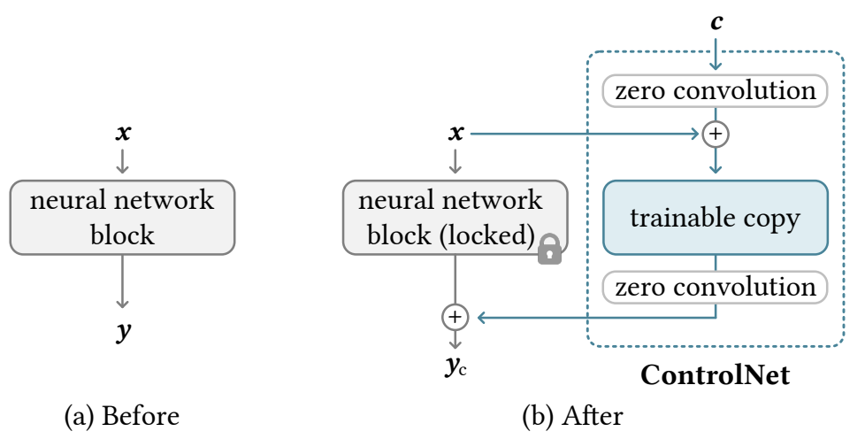

## 目录

- [1.ControlNet原理是什么？](#1.ControlNet原理是什么？)
- [2.什么是零卷积？](#2.什么是零卷积？)
- [3.零卷积起什么作用？](#3.零卷积起什么作用？)
- [4.ControlNet复制了U-Net的哪些层？](#4.ControlNet复制了U-Net的哪些层？)
- [5.为什么controlnet只复制了unet的编码层？](#5.为什么controlnet只复制了unet的编码层？)
- [原论文链接](https://arxiv.org/pdf/2302.05543)

<h2 id="1.ControlNet原理是什么？">1.ControlNet原理是什么？</h2>

1. **条件控制**：  
   ControlNet 的目标是通过输入条件（如边缘图、深度图、姿态信息等），指导生成模型（如 Stable Diffusion）生成符合特定约束的图像。

2. **双网络结构**：  
   - **主干网络 (Pre-trained Model)**：  
     使用一个已经预训练好的扩散模型（如 Stable Diffusion），作为生成图像的核心模型。
   - **辅助网络 (ControlNet)**：  
     添加一个条件网络（ControlNet），其结构和主干网络类似，但接受额外的控制输入。ControlNet 会在某些层添加条件特征，使主干网络可以在生成过程中参考这些特征。

3. **权重复用**：  
   - ControlNet 基于预训练扩散模型的权重，并在其上添加新的参数进行调整。这个设计保证了 ControlNet 在引入控制能力的同时，不会破坏原始模型的生成能力。

4. **冻结权重**：  
   - 预训练模型的权重通常是冻结的，ControlNet 通过调整自身参数来引导生成过程。

<h2 id="2.什么是零卷积？">2.什么是零卷积？</h2>

#### 零卷积的关键特性

1. **初始状态无影响**：
   - 在初始状态下，卷积核的权重为零，因此输入数据在经过零卷积层时不会发生改变，仅会受到偏置的影响。

2. **参数学习能力**：
   - 在训练过程中，零卷积层可以学习到适合的权重参数，从而逐步改变输入数据，增加模型对条件输入的适应性。

3. **轻量化设计**：
   - 零卷积层的初始行为相当于一个恒等映射（Identity Mapping），这使其不会破坏已有的预训练模型功能，同时保留了学习的灵活性。

<h2 id="3.零卷积起什么作用？">3.零卷积起什么作用？</h2>

在 ControlNet 中，零卷积通常用于处理**条件输入特征**，以实现以下功能：

1. **条件特征对主干网络的无损注入**：
   - 零卷积可以在初始状态下对输入的条件特征进行透明传递，确保不会干扰主干网络的功能。
   - 随着训练的进行，零卷积可以学习到如何将条件特征整合到生成流程中，使主干网络逐步受到条件的引导。

2. **梯度传递的稳定性**：
   - 零卷积层在初始状态下不对特征施加干扰，有助于稳定梯度传递，避免对原始预训练模型的破坏。

3. **条件融合的灵活性**：
   - 零卷积允许在不同层灵活地调整条件输入特征的影响范围，增强条件控制能力。

<h2 id="4.ControlNet复制了U-Net的哪些层？">4.ControlNet复制了U-Net的哪些层？</h2>

复制了U-Net中的Encode部分，decoder部分进行skip connection。
其中的复制层包括 12 个编码块 和 1 个中间块，覆盖 Stable Diffusion 的主要编码部分。

<h2 id="5.为什么controlnet只复制了unet的编码层？">5.为什么controlnet只复制了unet的编码层？</h2>

ControlNet 只复制 UNet 的编码层，而不复制解码层，是为了：
1.	**高效提取条件特征**：编码层是特征提取的关键部分，适合引入条件控制。
2.	**不干扰图像重建**：解码层专注于图像重建，不需要额外的条件控制。
3.	**降低计算成本**：减少不必要的参数复制，保持模型轻量化。
4.	**保持主干模型的生成能力**：保证对原始生成流程的影响最小。