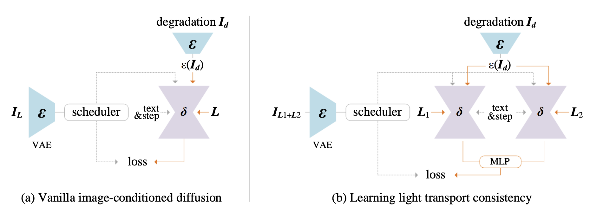

## 目录

- [1.IC-Light原理是什么？](#IC-Light原理是什么？)
- [2.训练方法](#2.训练方法)
- [原论文链接](https://arxiv.org/pdf/2312.04461)

<h2 id="1.IC-Light原理是什么？">1.IC-Light原理是什么？</h2>

**IC-Light** 的核心基于 **光传输一致性（Light Transport Consistency）** 的物理原理：

1. **线性混合原理**：
   - 物体在不同光照条件下的外观，其线性混合结果应该与该物体在混合光照条件下的外观一致。
   - 数学表达：
     \[
     I_{L1+L2} = I_{L1} + I_{L2}
     \]
     其中 \( I_{L1} \) 和 \( I_{L2} \) 分别为物体在光照条件 \( L1 \) 和 \( L2 \) 下的外观。

2. **一致性约束**：
   - 在扩散模型的训练中，通过损失函数约束模型的输出，确保只修改光照，不改变其他本质属性（如材质、颜色等）。
   - 损失函数形式：
     \[
     L_{\text{consistency}} = \| I_{L1+L2} - (I_{L1} + I_{L2}) \|_2^2
     \]

3. **数据处理与增强**：
   - 使用真实场景、渲染数据和合成光照数据构建多样化的训练集，增强模型对复杂光照场景的适应能力。

<h2 id="2.训练方法">2.训练方法</h2>

1. **数据预处理**：
   - 提取输入图像的反照率、背景信息和光照环境图。
   - 应用多种数据增强技术，生成随机光照变化的训练样本。

2. **损失函数设计**：
   - **基础损失（Vanilla Loss）**：指导模型生成基本光照编辑结果。
   - **一致性损失（Consistency Loss）**：通过光照一致性约束，保证模型对光照编辑的精确性。

3. **模型架构与优化**：
   - 基于扩散模型（如 Stable Diffusion 和 Flux），冻结 VAE 编码器，专注于光照特性优化。
   - 使用多层感知机（MLP）处理光照线性混合问题，增强模型的表达能力。