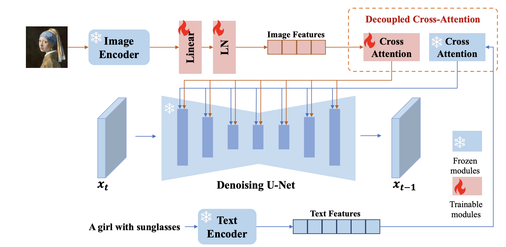

## 目录

- [1.IP-Adapter原理是什么？](#1.IPAdapter原理是什么？)
- [2.能介绍下解耦的交叉注意力机制吗？](#2.能介绍下解耦的交叉注意力机制吗？)
- [3.IP-Adapter是如何处理图像输入的？](#3.IP-Adapter是如何处理图像输入的？)
- [4.IP-Adapter FaceID模型有何变化？](#4.IP-AdapterFaceID模型有何变化？)
- [原论文链接](https://arxiv.org/pdf/2308.06721)

<h2 id="1.IP-Adapter原理是什么？">1.IP-Adapter原理是什么？</h2>

IP-Adapter 是一种**轻量化的图像提示适配器**，核心是**解耦的cross attention**，能够将图像特征与文本特征分开处理，同时嵌入到扩散模型中。它的设计保留了预训练模型的文本生成能力，同时支持图像 prompt 和多模态生成。通过冻结预训练模型并仅优化新增的注意力模块，IP-Adapter 实现了高效训练、广泛适配性和灵活的多任务能力，适合用于多模态图像生成和控制任务。

<h2 id="2.能介绍下解耦的交叉注意力机制吗？">2.能介绍下解耦的交叉注意力机制吗？</h2>

解耦的交叉注意力机制是 IP-Adapter 的核心创新之一。它将文本和图像特征分开处理，分别通过独立的交叉注意力层生成注意力输出，其中文本特征通过原始的交叉注意力层，图像特征通过新增的交叉注意力层，最后将两者结合。这种方法避免了特征之间的干扰，使图像特征更加细粒度地嵌入模型，同时保留文本生成能力。

<h2 id="3.IP-Adapter如何处理图像特征？">3.IP-Adapter如何处理图像特征？</h2>

使用 CLIP 图像编码器提取图像特征，这些特征通过一个轻量级投影网络（Linear + 归一化层LN)进行处理后，与预训练模型的特征维度对齐。

<h2 id="4.IP-Adapter FaceID模型有何变化？">4.IP-Adapter FaceID模型有何变化？</h2>

IP-Adapter FaceID 模型在 IP-Adapter 的基础上，使用ID Encoder来提取人脸特征，face ID embedding (提取人脸ID) + CLIP image embedding (提取人脸结构)。
